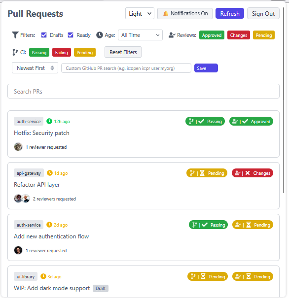
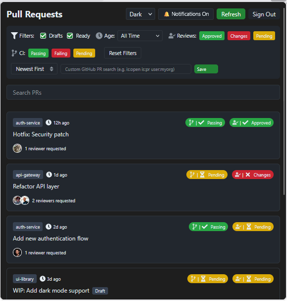

# PR Tracker - GitHub Pull Request Management Extension

<p align="center">
  
</p>

Chrome webstore link: [PR Tracker for Chrome](https://chromewebstore.google.com/detail/pr-tracker/kfeglmkcicfmegclihokchplngcokgil)


A browser extension to help you efficiently track and manage your GitHub pull requests. The extension provides status updates, filtering capabilities, and visual indicators for PR age, review status, and CI/build status.


## Features

- **PR Status Tracking**:
  - Visual indicators for PR age and staleness
  - Review status (approved, changes requested, pending)
  - CI/build status indicators
  - Draft PR indicators

- **Advanced Filtering**:
  - Filter by PR age (today, this week, older)
  - Filter by review status
  - Filter by CI status
  - Filter draft vs. ready PRs
  - Full text search across PR titles and repositories

- **Smart Sorting Options**:
  - Sort by newest/oldest
  - Sort by urgency (based on reviewer count)
  - Sort by staleness (prioritizing unreviewed PRs)

- **Visual Features**:
  - Dark/Light mode support
  - Reviewer avatars and counts
  - Status badges with intuitive colors
  - Timestamp indicators

## Installation

Download the extension from the Chrome Web Store or Firefox Add-ons site, or build it from source.

Chrome webstore link: [PR Tracker for Chrome](https://chromewebstore.google.com/detail/pr-tracker/kfeglmkcicfmegclihokchplngcokgil)

Firefox add-ons link: [PR Tracker for Firefox](https://addons.mozilla.org/en-US/firefox/addon/pr-tracker/) - (coming soon, currently in review) 

OR

1. Clone the repository:
   ```bash
   git clone https://github.com/yourusername/pr-tracker.git
   cd pr-tracker
   ```

2. Install dependencies:
   ```bash
   npm install
   ```

3. Build the extension:
   - For Chrome:
     ```bash
     npm run build:chrome
     ```
   - For Firefox:
     ```bash
     npm run build:firefox
     ```

4. Load the extension:
   - Chrome:
     1. Open `chrome://extensions/`
     2. Enable "Developer mode"
     3. Click "Load unpacked"
     4. Select the `dist-chrome` directory

   - Firefox:
     1. Open `about:debugging`
     2. Click "This Firefox"
     3. Click "Load Temporary Add-on"
     4. Select any file from the `dist-firefox` directory

## Usage

1. After installation, click the extension icon in your browser toolbar
2. Generate a GitHub personal access token with `repo` scope
3. Enter your token in the extension's authentication screen
4. **Create a password** to encrypt your token (required for security; this password is never stored and cannot be recovered)
5. Optionally, choose to remember your password for 12 hours for convenience
6. Start tracking your PRs!

## Password & Encryption

- Your GitHub token is **encrypted** using a password you create. This password is never stored or transmitted.
- If you forget your password, you must reset the extension and re-enter your token.
- You can choose to remember your password for 12 hours (stored in session memory, not persistent disk).

## Notifications

- The extension can show desktop notifications for new PR assignments or updates.
- You can toggle notifications on/off from the extension popup.
- **Note:** Notifications work only if the "Remember password" option is selected. This is required so the extension can access your token in the background to check for new PRs and send notifications.

## Screenshots

Light Theme:


Dark Theme:



## Troubleshooting / FAQ

- **Token not working?** Ensure it has the `repo` scope. You can [generate a new token here](https://github.com/settings/tokens/new?scopes=repo&description=PR%20Tracker).
- **Forgot your password?** There is no recovery. Use the "Reset App" button to start over.
- **No PRs showing?** Make sure your token is valid and you have open PRs assigned or authored.
- **Notifications not working?** Check your browser's notification permissions.