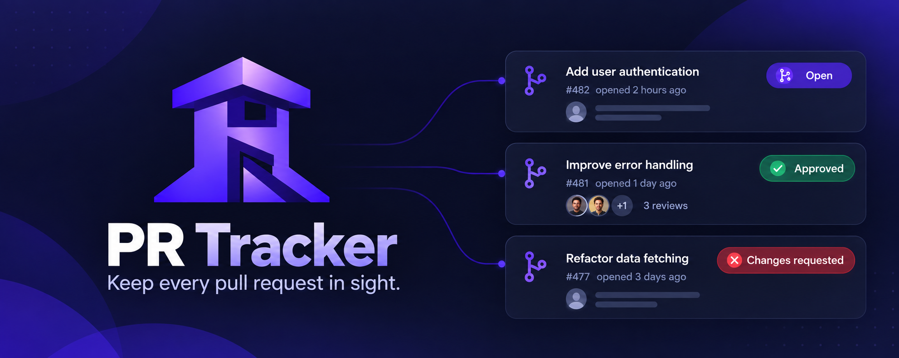
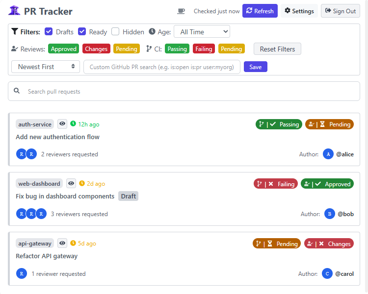
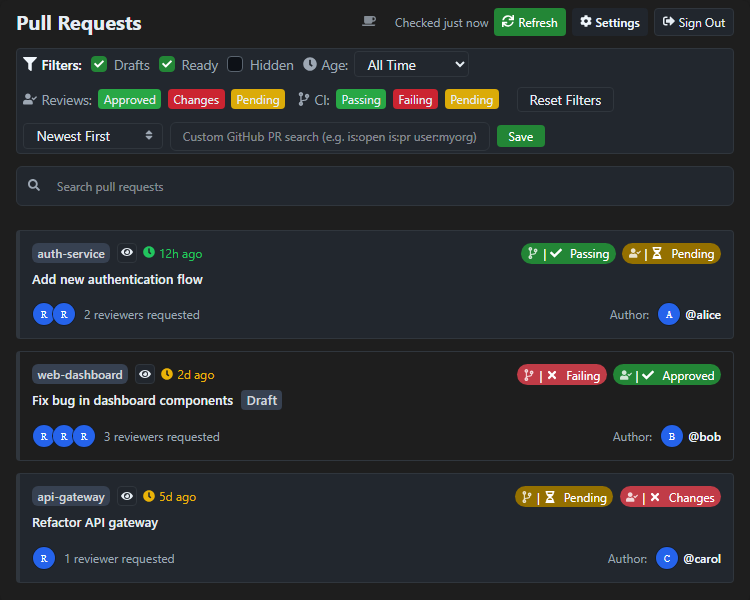
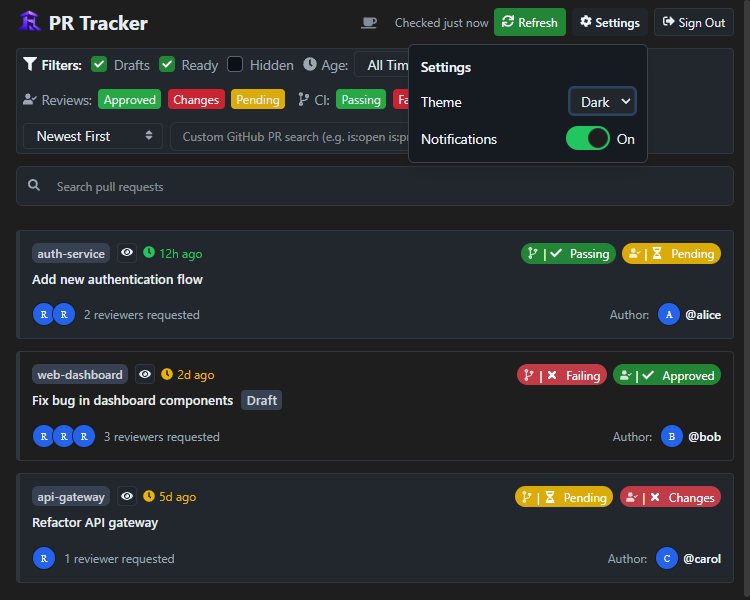

<p align="center">
  
</p>

<p align="center">
  <a href="https://chromewebstore.google.com/detail/pr-tracker/kfeglmkcicfmegclihokchplngcokgil"></a>
  <a href="https://addons.mozilla.org/en-US/firefox/addon/pr-tracker/"></a>
  <a href="https://github.com/aabiskar1/pr-tracker/actions/workflows/build.yml"></a>
  <a href="LICENSE"></a>
</p>

**PR Tracker** is a browser extension for Chrome and Firefox that brings your
GitHub pull requests and review requests into one compact popup. Check review
and CI status, find the PRs that need your attention, and see when GitHub was
last successfully checked.

## Install

- [Chrome Web Store](https://chromewebstore.google.com/detail/pr-tracker/kfeglmkcicfmegclihokchplngcokgil)
- [Firefox Add-ons](https://addons.mozilla.org/en-US/firefox/addon/pr-tracker/)

For a local build, follow the [development guide](docs/development.md).
This README describes the current source; store releases may lag behind it.

## Features

- **Track your work:** open PRs you authored and PRs requesting your review,
  or a saved custom GitHub search query.
- **Find what matters:** search titles and repository names; filter by age,
  draft/ready state, review status, and CI status. Sort by newest, oldest,
  reviewer count, or staleness. Hide PRs and show them again when needed.
- **Stay informed:** reviewer avatars, draft/review/CI indicators, a toolbar
  count, and desktop notifications for newly discovered tracked PRs.
- **Keep data fresh:** manual Refresh, five-minute background checks while an
  unlocked session is available, and a persisted **Checked …** indicator.
- **Make it yours:** Auto / Light / Dark themes and notification preferences
  in Settings. Auto follows your system theme.
- **Unlock locally:** password-protected, encrypted token and app data, with
  an optional remembered session.

## Screenshots

These captures use generic demonstration data from the current popup.

**Light theme**



**Dark theme**



**Settings**



## How it works

1. Open the extension and enter a
   [GitHub personal access token (classic) with `repo` scope](https://github.com/settings/tokens/new?scopes=repo&description=PR%20Tracker).
2. Create a password to encrypt your token and unlock stored data later.
   Optionally choose **Remember password for 12 hours**.
3. PR Tracker sends authenticated HTTPS requests directly to GitHub. By
   default it searches for your open authored PRs and review requests; saving
   a custom query replaces those default searches.
4. Use Refresh whenever needed. Background checks are scheduled every five
   minutes while an unlocked session is available, subject to browser scheduling
   and GitHub rate limits.

**Checked …** represents the last successful GitHub refresh whose PR data was
saved to encrypted storage. Opening the popup, loading cached data, or a failed
refresh does not advance it. Hover over the status for the exact local time;
before the first successful check it shows **Not checked yet**.

PR Tracker operates no separate backend. See the
[architecture guide](docs/architecture.md) for the data flow and storage details.

## Privacy & Security

- Your PAT and cached app data, including PR data and account preferences,
  are encrypted in local extension storage using a key derived from your
  password. Theme preference and some non-sensitive metadata are stored separately.
- Your password is held in memory while unlocked. If you enable the remembered
  session, it is also stored in extension session storage with a 12-hour expiry;
  this is not permanent storage across browser restarts.
- Authenticated requests send your token and query data directly to GitHub
  over HTTPS. Reviewer and author avatars may load from remote image URLs.
- **Sign Out** locks the session and retains encrypted account data for the
  next password unlock. If you forget your password, use **Full Reset** on the
  unlock screen to remove account data and start again. Theme preference is retained.

Read the [privacy policy](https://aabiskar1.github.io/pr-tracker/privacy.html)
([repository source](docs/privacy.html)).

## Development

Use Node.js 24 LTS and npm with the committed lockfile. Start with:

```sh
npm ci
npm run dev
```

- [Development guide](docs/development.md): setup, local loading, and Chrome/Firefox builds.
- [Testing guide](docs/testing.md): deterministic unit/E2E workflows and browser coverage.
- [Architecture guide](docs/architecture.md): popup, background checks, storage, and notifications.

## Contributing

Report bugs or suggest improvements through
[GitHub issues](https://github.com/aabiskar1/pr-tracker/issues).
For a code contribution, work on a dedicated branch, keep changes focused,
and include relevant tests and validation in your pull request. Follow the
[engineering guidance](AGENTS.md) and development guide.

## License

[MIT](LICENSE).
